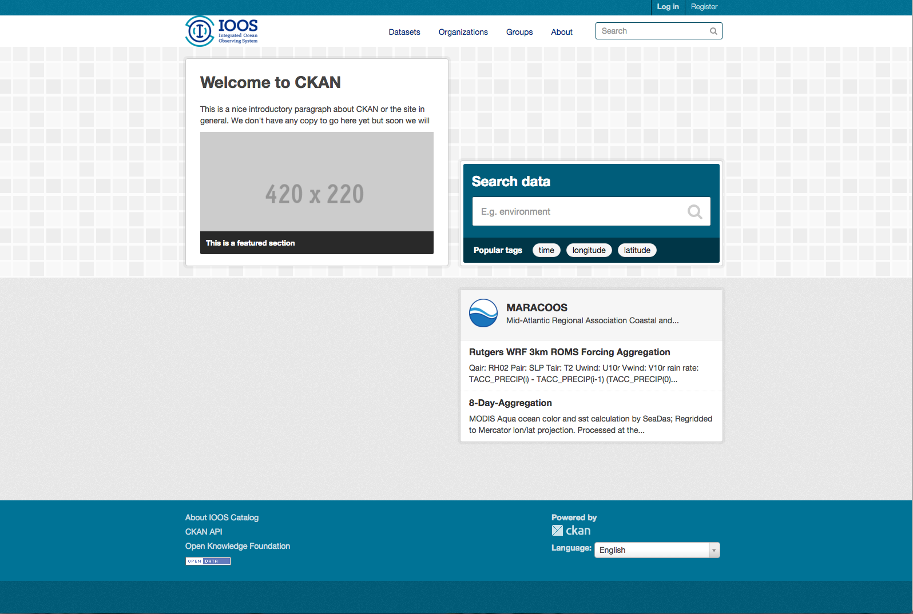
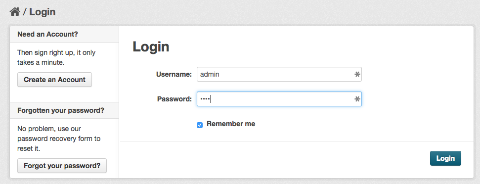
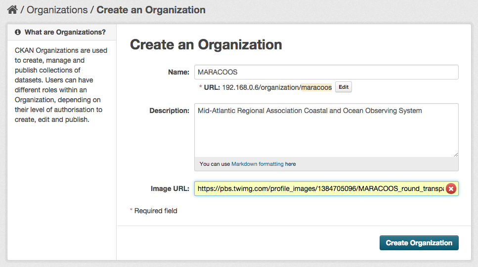
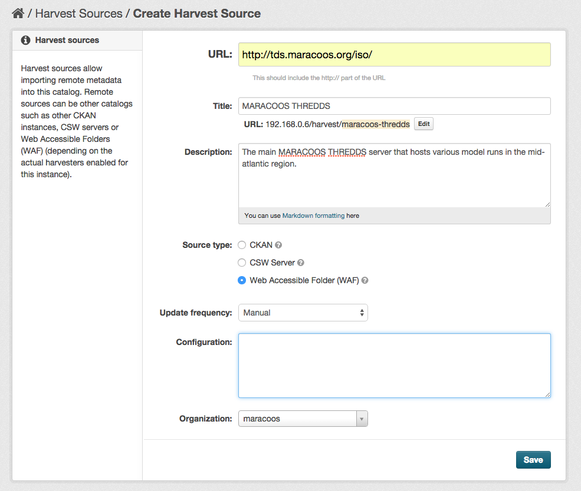
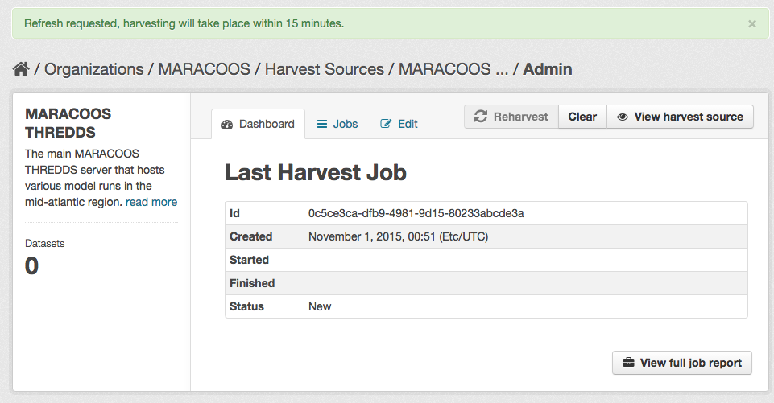
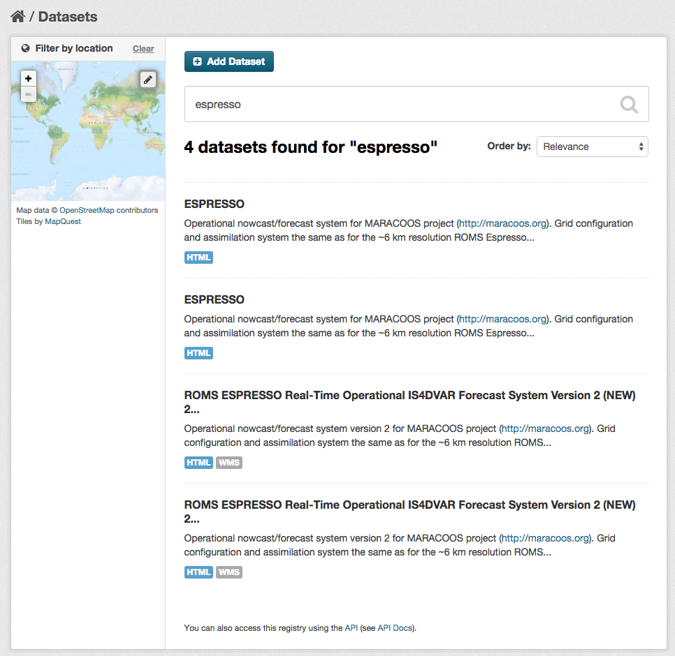
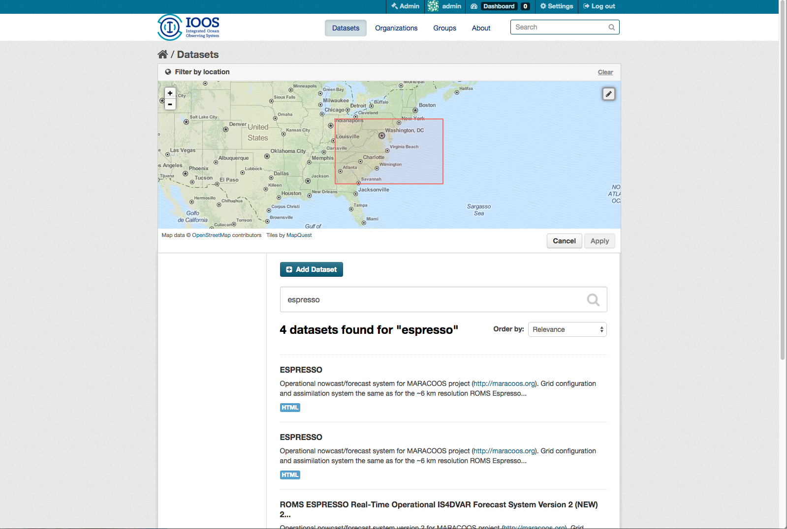
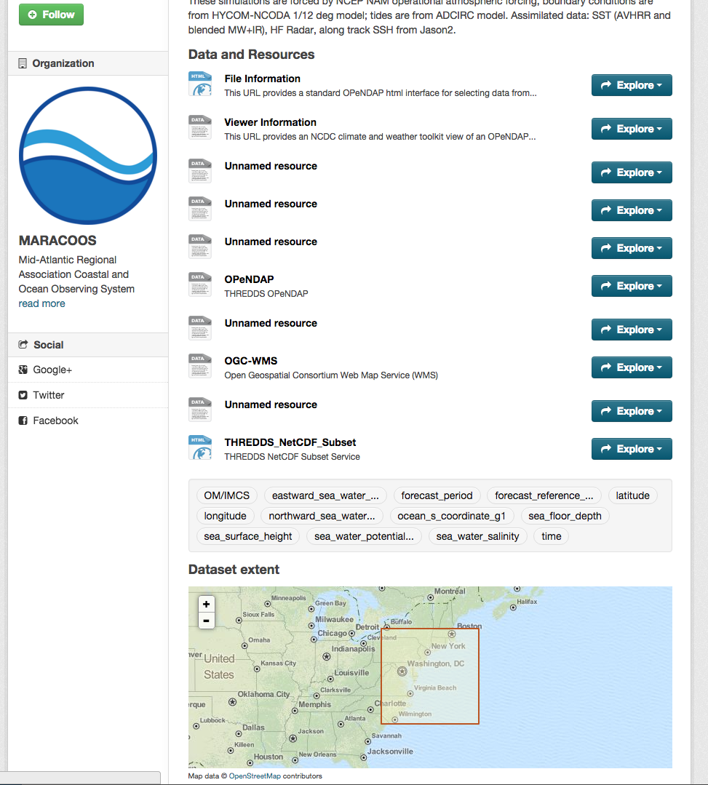

# Welcome to IOOS Catalog

## First steps after launch

When you first visit the page, you will be presented with something like:

### Logging in as an administrator

Select the "Log in" button from the navigation bar at the top. Enter the
administrator's username and password. The default values are "admin" and
"ckan". 

### Adding your first organization

I want to add a new organization within the catalog to represent MARACOOS. So,
after logging in I select "Organizations" and fill in the name, description,
Image URL and then click "Create Organization".

### Adding the data soruce for harvesting

Now that I've added MARACOOS to the organizations, I want to start ingesting
datasets. I can do this by adding a wAF to the harvest sources.

When you're logged in as an administrator go to the url "/harvest". Sorry,
there's no button for it yet.

Click "Add Harvest Source" and fill in the fields for the harvest.

Now click the "Admin" button, then click "Reharvest" to kick off the first harvest.

After a brief wait you should see the status update from "New" to "Running" to "Finished"

## Now I have data!

### Text Searching

Intuitively, you can search by typing in the serach box.

You can do a geospatial search by clicking the pencil icon within the map. Doing so, will enlarge the map and allow you to draw a box.

### Inspecting a Dataset

Datasets that have spatial information will include a map. Additionally, all
datasets will show the title, abstract information, available resources,
keywords etc.

